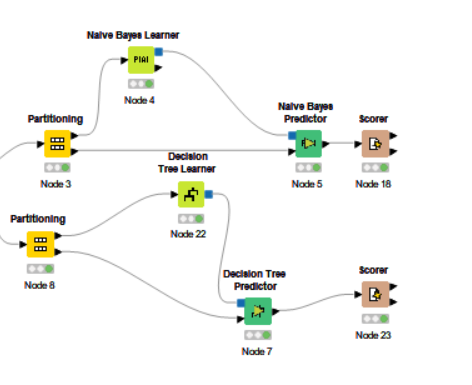

# Codeless-ai-ml-2022 project
## Overview
The project is about Freelance by using KNIME.  
The main objective of this project is to find out which model was the most accurate.

## Tools
- KNIME 

## Columns
- Industry  
- Project  
- Budget  
- Deadline  
- Hiring

We use 2 model to see wich model is the best for our data. Decision tree learner, Naive bayes learner.

## Conclusion
In this project, We used KNIME to determine which machine learning model is the most suitable to be used for the provided dataset.

## Author
Abdulhakeem Mahasae  631431017  
Charif Ulae 631431031 
